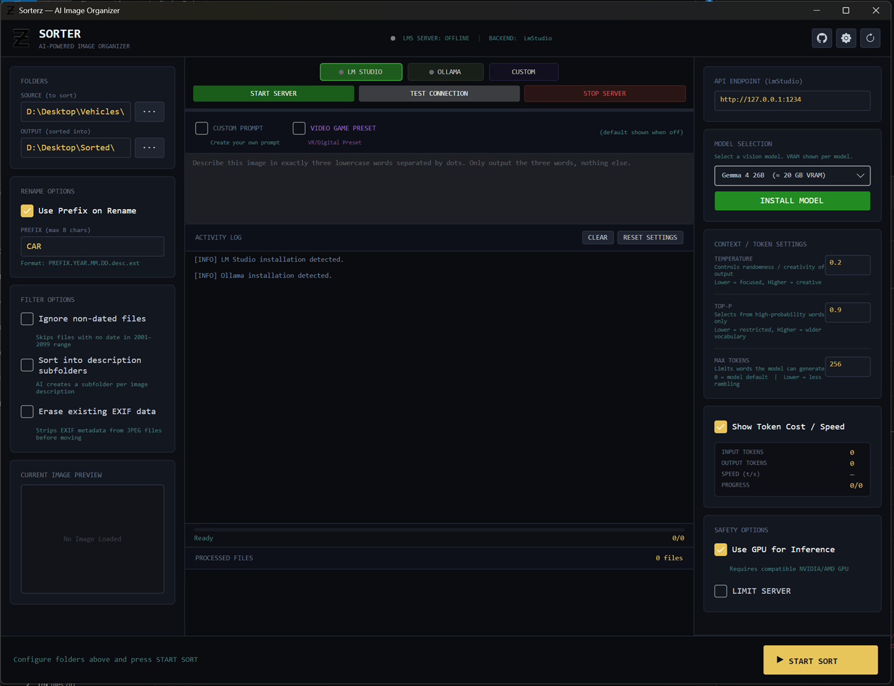

# 📸 Sorterz — AI Image Organizer

Sorterz is a high-performance desktop application designed to automatically organize your messy image collections using local Artificial Intelligence. Instead of manual sorting, Sorterz "looks" at your images and categorizes them into folders based on their visual content.



## ✨ Features

* **🤖 Local AI Vision:** Uses LM Studio (or any OpenAI-compatible local server) to analyze images. Your photos never leave your machine, ensuring 100% privacy.
* **📂 Intelligent Categorization:** Automatically assigns a single-word category (e.g., `nature`, `food`, `people`) to every image.
* **🏷️ Smart Renaming:** Generates descriptive filenames using a three-word dot-notation format (e.g., `mountain.snow.sunset.jpg`) for easy searching.
* **📊 Real-time Analytics:** Monitor token usage, processing speed (t/s), and progress as the sort happens.
* **⚙️ Fully Customizable:** Set your own prefixes, ignore non-dated files, and toggle token cost visibility.

## 🚀 Getting Started

### Prerequisites

1. **LM Studio:** Download and install [LM Studio](https://lmstudio.ai/).
2. **Vision Model:** Inside LM Studio, download a Vision-capable model (e.g., **Moondream**, **Llava**, or **Gemma-4-Vision**).
3. **Local Server:** Start the "Local Server" inside LM Studio to host the model on `http://127.0.0.1:1234`.

### Installation

1. Clone this repository:
   ```bash
   git clone https://github.com/yourusername/Sorterz.git
   ```
2. Navigate to the folder and run the executable:
   ```bash
   cd Sorterz
   ./Sorter.exe
   ```

## 🛠️ How to Use

1. **Configure Connection:** Enter your LM Studio URL (default `http://127.0.0.1:1234`) and ensure the correct Model Name is typed in.
2. **Set Folders:** 
    * Select your **Source Folder** (where your messy images are).
    * Select your **Output Folder** (where organized folders will be created).
3. **Adjust Settings:** Choose if you want to use a filename prefix (e.g., `IMG_`) or ignore files without EXIF date data.
4. **Start Sorting:** Click **▶ START SORT**. Watch the logs and progress bar as Sorterz works its magic!

## 🧠 How it Works

Sorterz sends a base64-encoded version of your image to your local AI server with a specific system prompt:

> *"Analyze this image carefully. Respond with ONLY valid JSON in this exact format: `{"category": "singleword", "description": "three.word.description"}`"*

The application then parses this JSON to create the directory structure and rename the files accordingly.

## 🛡️ Privacy & Security

Unlike cloud-based organizers, **Sorterz is privacy-first**. Because it communicates with a local server (LM Studio), your images are processed entirely on your own hardware. No data is uploaded to the internet.

## 📄 License

Distributed under the MIT License. See `LICENSE` for more information.
